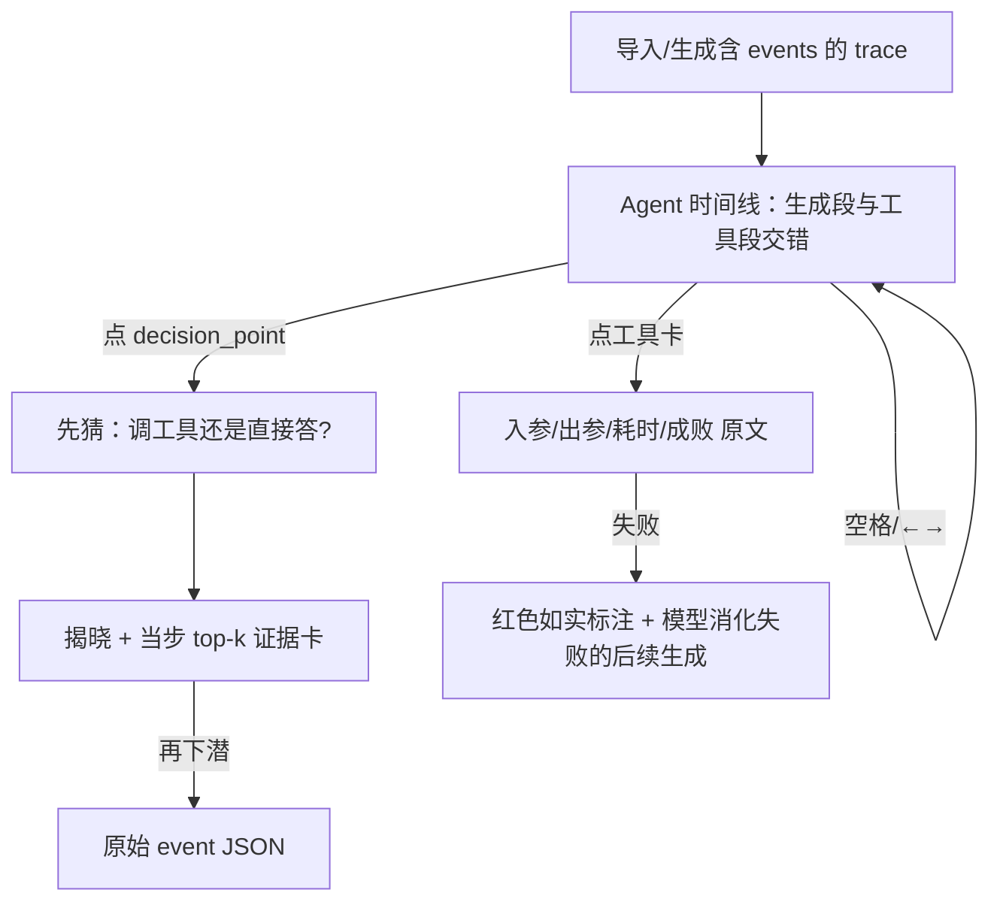

# 体验稿 · Agent 观察（E4）

> 事实源锚点：《直通 E5 完整规划》§E4（E4a 观察格式先行 / E4b 本机 Agent Demo spike，时间盒 1 天，可公开搁置）。
> 本稿只做纸面体验设计，不写代码（轨道二）。规则住址不重复（NRP）：原则/词表/token 一律 `See` 速查表与 AODL。
>
> 本稿只回答一个问题：**当用户第一次"观察一个 Agent 干活"时，认知应该如何建立？**

---

## 1 · 认知定位（Cognitive DNA）

- **接观察阶梯哪一阶**：阶 6「下一个问题」的承接者。用户在 Core Loop 里已经建立"生成 = 逐 token 采样"的认知，自然的下一个问题是：**"那 Agent 呢？它'决定用工具'的那一刻，也是采样出来的吗？"**——E4 的入口就长在这个问题上（原则一：问题先于知识）。
- **核心认知命题**：Agent 不是新物种。**工具调用只是"生成了一段特殊格式的 token"，Agent 的每个'决定'都是一个可下钻的犹豫点。** 用户带着已有的 trace/犹豫点/分岔认知进来，发现同一套仪器直接对准 Agent 也成立——这是本模块要制造的"原来如此"。
- **埋哪个下一阶钩子**：decision_point 可展开当步 top-k → 埋"这一步如果采样到另一个候选，它会调用别的工具吗？"（通往分岔/对比的旧能力，观察是复利）。
- **唤起哪条已有经验（Memory Before Novelty）**：人人见过"AI 助手说'正在搜索…'然后给出答案"却从没见过中间发生了什么。旧知「Agent 会自己用工具」→ 新知「所谓'自己决定'，就是这一步 `tool_call` 的 token 概率赢过了直接作答的候选」。

## 2 · 认知随访问次数生长

- **第一次**：在时间线上看到生成段与工具段**交错**——第一次"看见"Agent 的一步步，而不是只看到最终答案。认知：Agent = 生成 + 调用的交替，不是黑盒魔法。
- **第二次**：点开一个 decision_point，看到当步 top-k 里 `tool_call` 只比直接回答高 X%。认知：**"决定用工具"也是采样**，同一套概率语言。
- **第三次**：撞见一次失败调用（红色如实标注、原始出参可展开）。认知：小模型的工具调用**会失败，失败长这样**——失败也是数据（See 速查表 §2 P23）。
- **第五次**：导入别人给的含 events 的 .aitrace，或对同一任务换 seed 重跑（若 E4b 上线），比较两次工具调用序列是否一致。认知：Agent 行为同样可复现、可比较——回到阶 4/阶 6。

## 3 · 产品语法五行（缺一行不立项）

```text
Question    → Agent 说"我去查一下"的那一刻，它内部发生了什么？
Evidence    → 真实 events 时间线：生成段 token 流 + 工具卡（入参/出参/耗时），decision_point 展开当步 top-k
Interaction → 步进/暂停/跳转沿用时间语法动词（Agent 事件也是"步"，不新造动词，See 速查表 §5）；工具卡可展开原始出入参
Conclusion（用户产生）→ "原来 Agent 的'决定'也是采样出来的 / 原来小模型是这样在工具调用上失败的"
Replay / Next Question → 同 seed 重放整条 agent trace；下一问："换个 seed 它还会用这个工具吗？"
```

## 4 · 数据来源（Evidence First）

- **唯一数据源**：.aitrace 的 agent 扩展段 `events[]`（tool_call / tool_result / decision_point，字段只增不改，锚点 §E4a）。每张工具卡的入参/出参/耗时都来自真实 event 记录；decision_point 的 top-k 仅当调用方在采集时提供了当步 logits 才显示。
- **如实缺席**（三层，逐层诚实）：
  1. 无任何 agent 数据 → **视图不出现在导航**（不上线空壳，锚点红线）；
  2. 有 events 但某 decision_point 未附 top-k → 该步展开处显示"本 trace 未采集当步候选分布"（不估、不画示意图）；
  3. E4b spike 失败 → 页面保留 E4a 回放能力 + 一行"本机 Agent Demo 已搁置（原因：…），可导入外部 agent trace"（公开搁置，写进 roadmap 备忘）。
- **失败调用**：出参解析失败/工具报错与成功同格式呈现（红色 Badge），原始输出永远可展开——「亲眼看小模型在工具调用上如何失败」是本模块的诚实产品故事之一。

## 5 · 界面与流程

**入口**：仅当当前档案/导入文件含 `events[]` 时，导航出现「Agent」入口；否则不出现（如实缺席）。

**第一屏 · Agent 时间线**（垂直步进列表，锚点 §E4 设计角度）
- 生成段 = 现有 token 流样式**压缩条**（显示段内 token 数、耗时；点击展开为完整 token 流——复用，不新造）；
- 工具段 = 独立卡：工具名 + 入参摘要 + 出参摘要 + 耗时（等宽数字，See 速查表 §3）；失败卡红色 Badge「调用失败」；
- decision_point = 生成段与工具段的交界处一个可点的犹豫点标记（复用暂停帧/犹豫点视觉语言）。
- 每屏唯一主动作 = 播放/步进（空格/←→，时间语法动词原样复用）。

**第二屏 · decision_point 下钻**（三级下潜语法原样复用，不跳页）
- ①陈述句：「这一步，`tool_call` 候选概率 X%，直接作答候选 Y%」→ ②证据卡：当步 top-k 条形 + 来源路径 → ③原始层：该 event 的 JSON。
- 先猜后验（原则六，轻量可跳过）：展开 top-k 前先问「你猜它这一步会调用工具，还是直接回答？」→ 揭晓实际采样结果。

**第三屏 · 工具卡展开**
- 入参 / 原始出参 / 耗时 / 成功与否，全部原文；失败时同屏显示模型收到失败结果后的下一段生成（失败如何被"消化"也可观察）。



## 6 · 动画（Motion Bible）

- 时间线步进到达脉冲 = **因果类**，150ms（复用现有跳转到达脉冲）；
- decision_point 证据卡展开 = **空间类**，300ms 原位推挤（下潜三级标准动效）；
- 工具卡"调用中→已返回"状态切换 = **时间类**，直接变、不做转圈假等待（真实耗时以数字呈现，See 速查表 §3 动效红线）；
- 失败态立即静止呈现，零动效。一屏无 600ms 叙事入场（本页是仪器页不是首屏）。

## 7 · 文案（AI Vocabulary）

- 「Agent 决定使用工具」→ **「这一步，`tool_call` 候选概率 X%，高于直接作答的 Y%」**（"决定"只作索引名，点开即概率证据）；
- 「Agent 正在思考下一步」→ **「正在生成第 N 个 token」**（改写范式原样复用，See 速查表 §1）；
- 「工具调用失败」→ **「出参未通过解析（原文可展开）」**——陈述事实，不写"它搞错了"；
- 页顶口径行（P12）：「本视图展示 trace 内记录的 events；未采集当步分布的 decision_point 不显示候选概率。」

## 8 · AODL 依据与失败判据

- **可回溯条目**：L1 认知阶梯阶 6 承接 + 原则二/三/五/六；L2 第七轴「可观察不可装饰」（时间线每个元素都回答"让用户观察到 Agent 的什么"——答不出的装饰一律不进）；L3 时间语法动词复用（速查表 §5）；L4 组件全复用（token 流/犹豫点/EvidencedClaim/Badge/三级下潜），本模块**零新交互模式**；上游锚点 §E4（schema 先行、E4b 时间盒、不上线空壳）。
- **最可能死掉的方式（失败判据）**：
  1. **E4b spike 失败且长期无外部 agent trace** → E4a 沦为"没人喂数据的空仪器"。兜底：公开搁置 + 随产品内置**一份真实录制的 agent demo trace**（哪怕是失败率很高的那种——失败也是数据），保证视图有第一份真数据才上线。
  2. **decision_point 无 top-k 成为常态**（多数外部 trace 不含 logits）→ 核心下钻体验退化为纯日志查看器。判据：若内置 demo 之外 ≥80% 的 decision_point 无候选分布，本模块认知价值不成立，退回重估采集方案。
  3. **时间线新造交互动词**（如给工具卡加独立播放器）→ 违反"Agent 事件也是步"的语法约束，属口径事故级回退。
