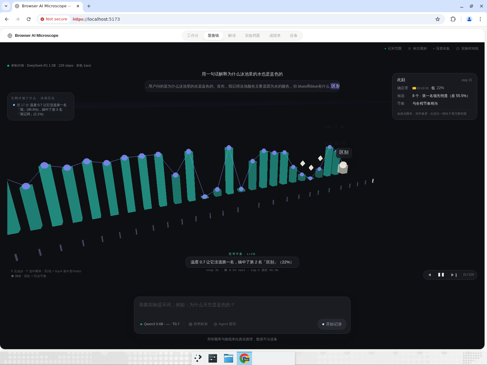
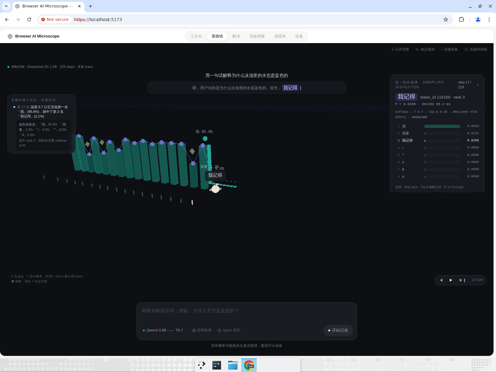
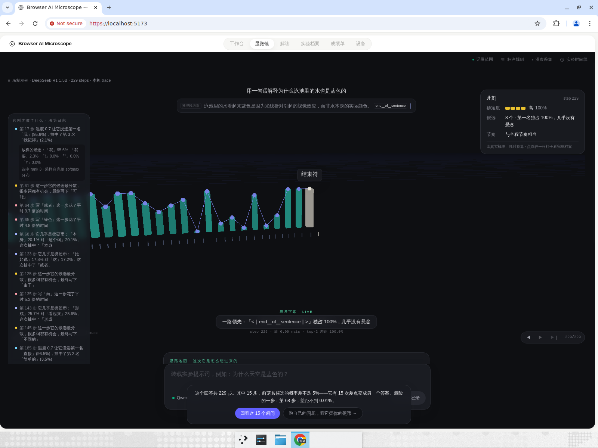
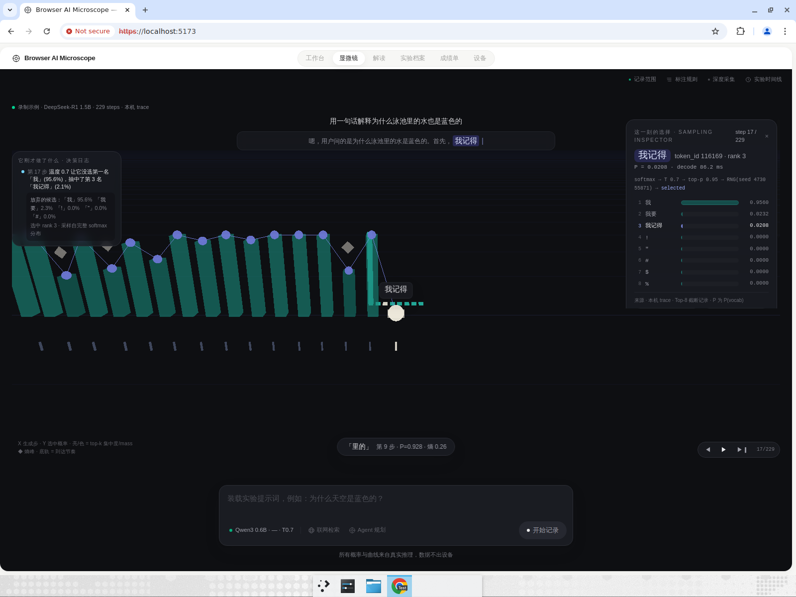
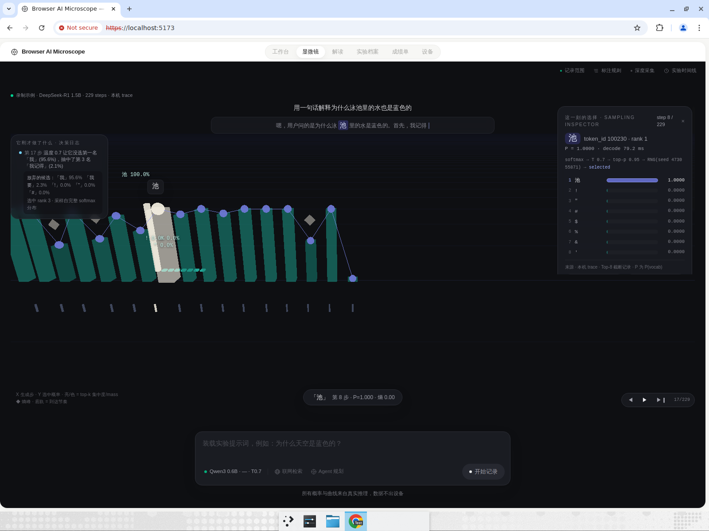
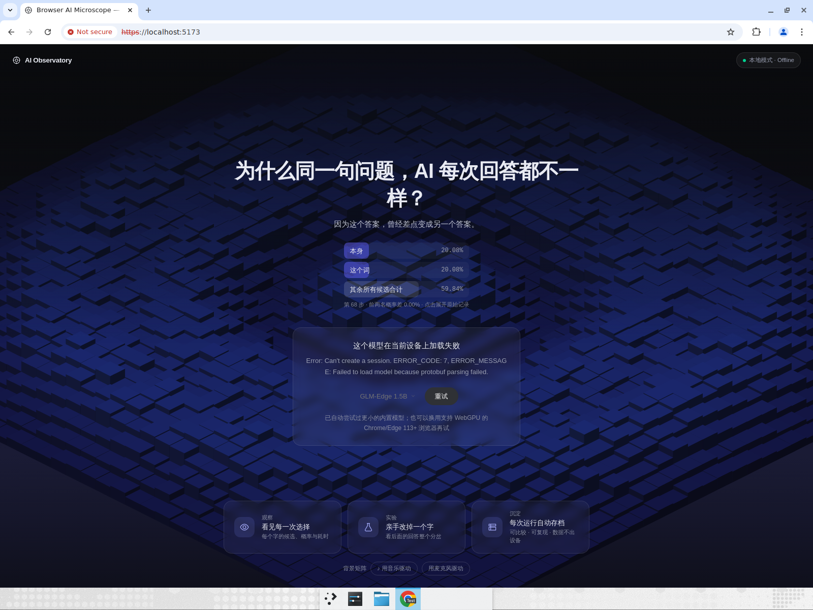
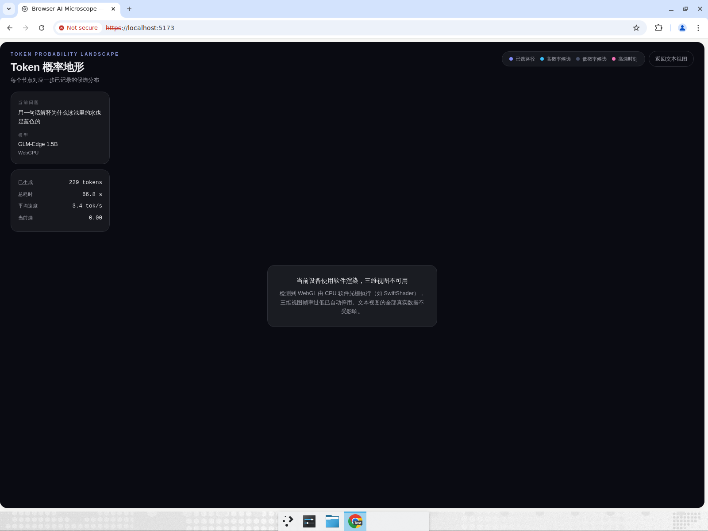

# 决策优先 v2（S1–S6）浏览器实测报告

日期：2026-07-25 · 环境：云端 Linux VM · Chrome（无 GPU，WebGL=SwiftShader 软件光栅）· `npm run dev` https://localhost:5173
静态验证：`npx tsc -b` ✅ · `npm run lint` ✅ · `npx vitest run` 309/309 ✅ · `npm run build` ✅（Node 22.23.1）

## 结果总览

| 项 | 内容 | 结果 |
|---|---|---|
| T1 | S1 决策日志人话化 | **PASS** |
| T2 | S2 标本台可读性 + 高光冻结 | **PASS** |
| T3 | S3 BirthScene 词表投票场景 | UNTESTED（环境限制，见下） |
| T4 | S4 检索舞台 | UNTESTED（环境限制） |
| T5 | S6 慢速跟播（OceanView） | UNTESTED（环境限制） |

## T1 · 决策日志人话化 — PASS

- 标题为「它刚才做了什么 · 决策日志」（旧版「内心独白 · 活动日志」已消失）。
- 事件全部为人话：如「温度 0.7 让它没选第一名『我』(95.6%)，抽中了第 3 名『我记得』(2.1%)」「它几乎是掷硬币：『本身』20.1% 对『这个词』20.1%」「这一步它的候选最分散」「写『而』这一步花了平时 5.3 倍的时间」——四类事件（掷硬币/温度改命/想法很散/卡住了）均在 demo 回放中真实出现。
- 点击事件跳到对应 trace step（Sampling Inspector 同步定位第 17 步）并展开「放弃的候选：『我』95.6% 『我要』2.3% …」+ 证据口径「选中 rank 3 · 采样自完整 softmax 分布」。

## T2 · 标本台可读性 + 高光冻结 — PASS

- hover 柱子时信息出现在**底部居中信息条**（「『里的』 第 9 步 · P=0.928 · 熵 0.26」），不再贴柱遮挡。
- 点击聚焦第 8 步后：该步高亮白色 + 候选标签展开（池 100.0% / ! 0.0% …），其余柱明显退暗（冻结感）。
- 当前 token 标签字号明显更大、带底卡可读；候选标签高低交错避让。

## T3/T4/T5 · UNTESTED（环境限制，非代码缺陷）

云端测试 VM 的两个硬限制：

1. **无法真机生成**：VM 无 WebGPU；ONNX 模型下载经代理被截断，加载报
   `Can't create a session. ERROR_CODE: 7 … protobuf parsing failed`（页面按设计给出诚实错误卡并自动尝试更小模型，未伪造任何状态）。
   → T3（BirthScene 触发需生成中命中犹豫点）与 T4（检索舞台需真实 webSearch + 生成）无法端到端执行。
2. **三维视图诚实降级**：WebGL 由 SwiftShader 软件光栅执行，OceanView 按设计自动停用三维并给出说明卡（「当前设备使用软件渲染，三维视图不可用」）。
   → T5「慢速」按钮位于三维回放条内，此环境不渲染，无法点击验证；其逻辑（200ms/步 vs 50ms/步、aria-pressed、running 禁用）已由代码审查 + 静态验证覆盖。

以上两个「失败/降级画面」本身即 P9/P24 要求的诚实状态展示，实测符合设计。

**建议**：在本机（有 GPU + 可下载模型）跑一次真实生成，复核 T3/T4/T5——预计各 1 分钟内可完成。

## 附加验证

- 通过「导入 .aitrace」导入 demo trace → 档案卡 → 对话式档案页 → 回放进实验台，全链路正常；思路地图、没走的路、Observation Log 数据均来自真实 trace。
- 单测已覆盖：`lib/decisions.test.ts`（7 例，四类事件判定/预算/排序）、director、TokenText 等共 309 例全绿。
